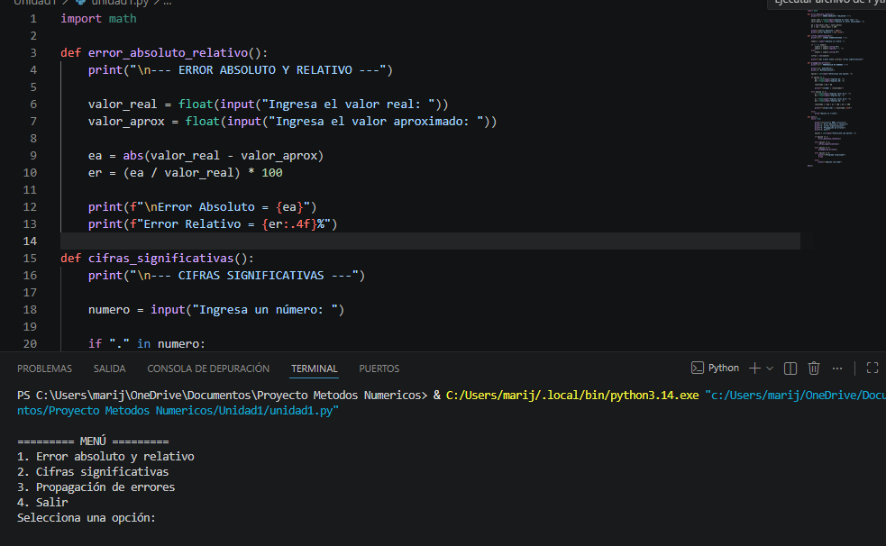
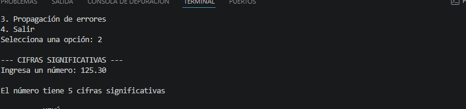

# Unidad 1: Errores y Cifras Significativas

## Objetivo

Desarrollar un programa en Python que permita analizar la precisión de resultados numéricos mediante el cálculo de errores, cifras significativas y propagación de errores.

## Fundamento Teórico

En los métodos numéricos es fundamental conocer la precisión de los resultados obtenidos. Para ello se utilizan diferentes herramientas matemáticas:

### Error Absoluto

Mide la diferencia entre un valor real y un valor aproximado.

### Error Relativo

Representa la relación entre el error absoluto y el valor real, expresada generalmente en porcentaje.

### Cifras Significativas

Son los dígitos que aportan información relevante sobre la precisión de una medición o cálculo.

### Propagación de Errores

Permite estimar cómo afectan los errores individuales de las variables a los resultados finales de una operación matemática.

## Descripción del Programa

El programa presenta un menú interactivo que permite al usuario seleccionar diferentes opciones relacionadas con el análisis de errores numéricos.

Las operaciones implementadas son:

* Cálculo de error absoluto.
* Cálculo de error relativo.
* Determinación de cifras significativas.
* Propagación de errores en operaciones básicas.

## Archivo Principal

```text
unidad1.py
```

## Algoritmo General

1. Mostrar el menú principal.
2. Solicitar la opción deseada.
3. Ejecutar la función correspondiente.
4. Mostrar los resultados obtenidos.
5. Regresar al menú principal o finalizar el programa.

## Funciones Implementadas

### Error Absoluto y Relativo

Solicita un valor real y un valor aproximado para calcular los errores correspondientes.

### Cifras Significativas

Determina la cantidad de cifras significativas presentes en un número ingresado por el usuario.

### Propagación de Errores

Calcula la propagación de errores para operaciones de suma, resta y multiplicación.

## Evidencias de Ejecución

### Menú Principal



### Error Absoluto y Relativo


### Cifras Significativas



### Propagación de Errores


## Resultados

El programa realiza correctamente los cálculos asociados al análisis de errores numéricos, mostrando los resultados de manera clara y organizada.

## Conclusiones

* Se comprendió la importancia de los errores en los métodos numéricos.
* Se implementaron herramientas para evaluar la precisión de los resultados.
* Se reforzó el uso de Python para resolver problemas matemáticos.
* El programa permite analizar diferentes situaciones relacionadas con el manejo de errores numéricos.
